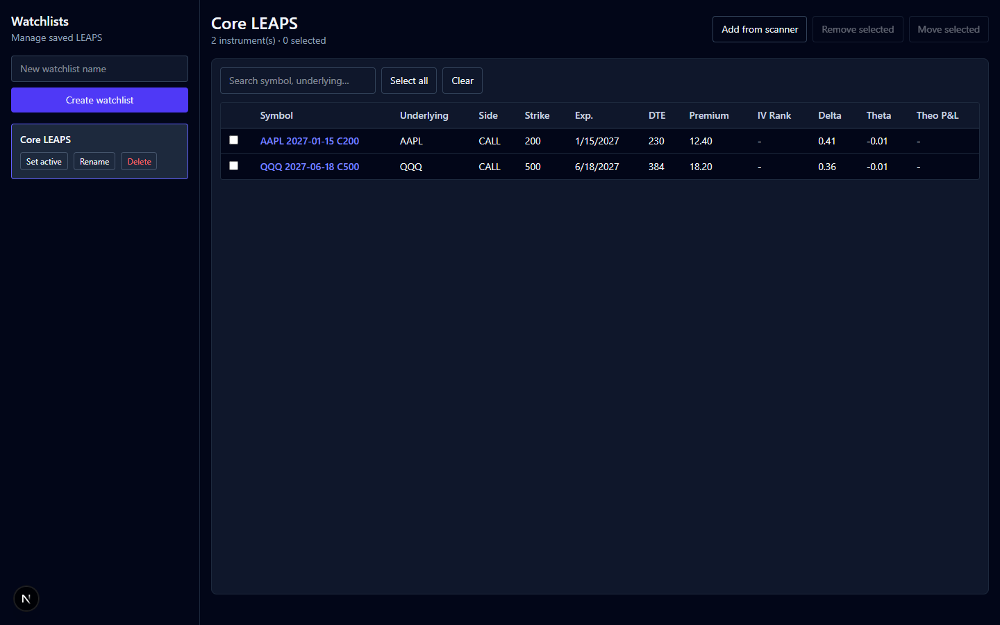
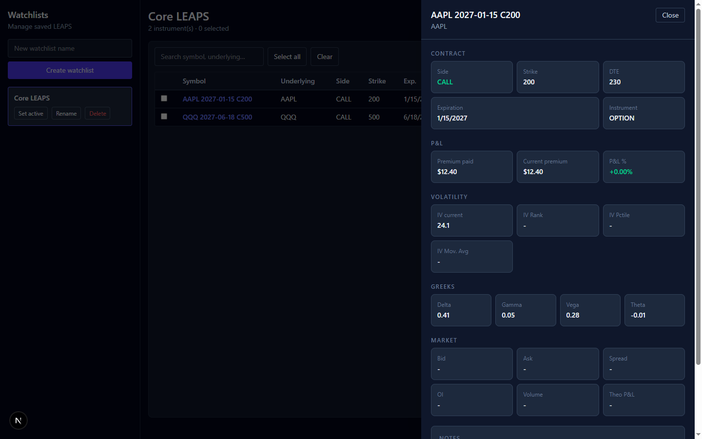
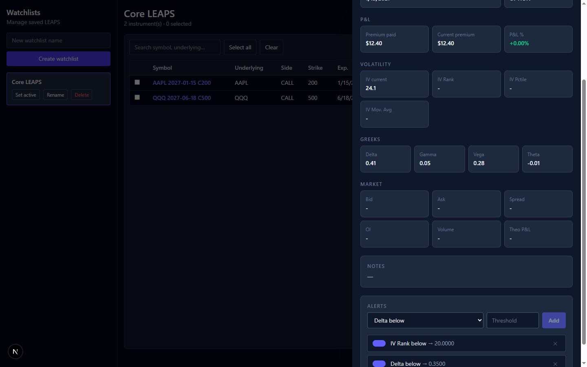

# Coiled Spring Strategy App

A disciplined LEAPS options watchlist and portfolio tool for antifragile, long-Vega, risk-defined trading on US markets.

> Not a generic scanner. A machine of optionality that helps you discard what doesn't deserve capital.

---

## Screenshots

### Watchlist — Core LEAPS


### Item drawer — AAPL 2027 C200


### Alerts


---

## Stack

| Layer | Technology |
|-------|-----------|
| Backend | Python 3.13 + FastAPI + SQLAlchemy |
| Database | PostgreSQL |
| Frontend | Next.js 16 + TypeScript + Tailwind CSS v4 |
| Auth | JWT (PyJWT) via httpOnly cookie |

---

## Features

- **Watchlists** — create, rename, delete, set active
- **LEAPS tracking** — add options from scanner with full greeks (Δ, Γ, Vega, Θ)
- **Item drawer** — contract details, P&L, volatility, greeks, market data
- **Alerts** — per-instrument alerts (IV Rank, Delta, DTE, price) with enable/disable toggle
- **Scanner modal** — select candidates and bulk-save to watchlist
- **Dark theme** throughout

---

## Project structure

```
coiled-spring/
├── backend-python/          # FastAPI backend
│   ├── main.py              # App entry point
│   ├── requirements.txt
│   ├── setup_db.py          # One-time DB schema creation
│   └── app/
│       ├── models.py        # SQLAlchemy ORM models
│       ├── schemas.py       # Pydantic request/response schemas
│       ├── dependencies.py  # JWT auth dependency
│       └── routers/
│           ├── auth.py
│           ├── watchlists.py
│           └── watchlist_items.py  # items + alerts
│
├── frontend-next/           # Next.js frontend
│   ├── proxy.ts             # Auth guard (redirect to /login)
│   ├── app/
│   │   ├── login/           # Login page
│   │   ├── watchlists/      # Main watchlist page
│   │   └── api/             # Proxy routes → FastAPI
│   ├── components/
│   │   └── watchlist/       # Sidebar, Table, Drawer, Scanner modal
│   └── lib/
│       ├── python-api.ts    # Authenticated fetch to FastAPI
│       └── transform.ts     # snake_case → camelCase + format mapping
│
├── database/
│   └── migrations/          # Raw PostgreSQL schema (source of truth)
│       ├── 001_init_watchlist.sql
│       └── 002_init_saas_auth.sql
│
└── backend/                 # Legacy Node.js/Express (reference only)
```

---

## Getting started

### Prerequisites

- Python 3.11+
- Node.js 20+
- PostgreSQL running on port 5433

### 1. Backend

```bash
cd backend-python

# Create virtualenv and install dependencies
python -m venv .venv
.venv\Scripts\activate        # Windows
source .venv/bin/activate     # macOS/Linux

pip install -r requirements.txt

# Configure environment
cp .env.example .env
# Edit .env with your DATABASE_URL and SECRET_KEY

# Create database tables
python setup_db.py

# Start server
uvicorn main:app --reload --port 8000
```

API docs available at `http://localhost:8000/docs`

### 2. Frontend

```bash
cd frontend-next

npm install

# Start dev server
npm run dev
```

Open `http://localhost:3000` — you'll be redirected to the login page.

### Default demo user

Register a new account via `POST /api/auth/register` or the API docs, then log in at `http://localhost:3000/login`.

---

## API overview

| Method | Endpoint | Description |
|--------|----------|-------------|
| POST | `/api/auth/register` | Register new user |
| POST | `/api/auth/login` | Login → JWT |
| GET | `/api/auth/me` | Current user profile |
| GET | `/api/watchlists` | List watchlists |
| POST | `/api/watchlists` | Create watchlist |
| PATCH | `/api/watchlists/{id}` | Rename |
| DELETE | `/api/watchlists/{id}` | Delete (cascade) |
| POST | `/api/watchlists/{id}/activate` | Set as active |
| GET | `/api/watchlists/{id}/items` | List items with greeks |
| POST | `/api/watchlists/{id}/items/bulk-add` | Add LEAPS contracts |
| DELETE | `/api/watchlists/{id}/items/{item_id}` | Remove item |
| POST | `/api/watchlists/{id}/items/bulk-delete` | Remove multiple |
| POST | `/api/watchlists/{id}/items/move` | Move between watchlists |
| GET/POST | `/api/watchlists/{id}/items/{item_id}/alerts` | Alerts CRUD |
| PATCH/DELETE | `/api/watchlists/{id}/items/{item_id}/alerts/{alert_id}` | Update/delete alert |

---

## Database schema

Core tables (defined in `database/migrations/001_init_watchlist.sql`):

- `users` — accounts
- `watchlists` — named lists per user
- `option_contracts` — normalized contract definitions (underlying, type, strike, expiration)
- `watchlist_items` — contract + entry greeks per watchlist
- `option_snapshots` — time-series snapshots (for future IV tracking)
- `alerts` — per-item threshold alerts
- `scan_runs` — scanner session history

---

## Roadmap

- [ ] IBKR integration via `ib_insync` (live greeks, bid/ask, IV)
- [ ] IV Rank / IV Percentile calculation from historical data
- [ ] P&L tracking with real-time premium updates
- [ ] Alert notifications (email / push)
- [ ] Scanner engine with configurable filters (DTE, delta range, IV rank)
- [ ] SaaS billing layer (plans, subscriptions)
